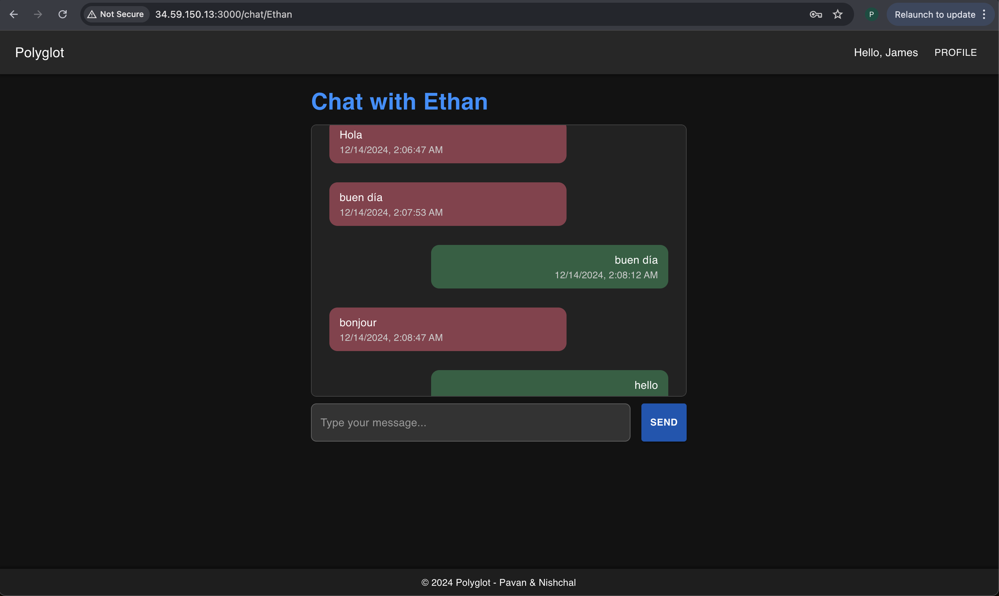

# ChatTranslationApp

# Real Time Chat Translation Application (Polyglot)

## Introduction

**Polyglot** is a feature-rich, real-time chat application designed to enable seamless communication between users while supporting message translations into multiple languages. The app is built with a modern tech stack using React for the frontend, FastAPI for the backend, and Apache Kafka for message brokering. It incorporates real-time notifications and a persistent chat history, making it ideal for multilingual teams and global users. 

The app also supports user-specific language preferences, ensuring every message is automatically translated into the preferred language of the recipient, fostering an inclusive and collaborative experience.

---

## Functionalities/Features

1. **Real-Time Messaging**
2. **User Authentication**
3. **Chat History**
4. **Language Translation**
5. **Real-Time Notifications**
6. **Interactive Chat List**

---

## Screenshots





---

# Steps to run  

## Local
Tested this with the following env - Python 3.11, Node - v22.11.0, Kubectl version - v1.31.2/v5.4.2/v1.30.2

1. We have made a docker-compose file, which should make building things easy.
2. Go to each of the backend and frontend dir and run the following cmds that will create an image of the backend and frontend service on your local
```sh
docker build -t backend .
docker build -t frontend .
```
3. After that come to the parent directory and run `docker compose up -d`
4. At this point you should be able to see all the services except frontend come up.
5. Run the frontend code separetly - `npm i and npm start`

## GKE
1. Publish your frontend and backend images to your docker hub repo. You can get into the respective backend/frontend dirs, open Makefile and modify your username. Run
```sh
docker login
make
make push
```
2. Copy all of your deployment + pvc + service yaml scripts present in deployments/. Run
```sh
docker login
kubectl apply -f redis-deployment.yaml
kubectl apply -f mongo-deployment.yaml
kubectl apply -f postgres-deployment.yaml
kubectl apply -f zookeeper-deployment.yaml
kubectl apply -f kafka-deployment.yaml
kubectl apply -f backend-deployment.yaml
<do kubectl get svc and get the external IP. Put this in the frontend-deployment.yaml file>
kubectl apply -f frontend-deployment.yaml
```
3. This should bring up all the necessary services.

---

# Few useful commands to use for debugging
## docker cmds
```sh
docker exec -it <pod> bash
docker logs <pod>
docker describe pod <pod> # watch for network, pvc, ip, logs related info
```

## postgres cmds
```sh
psql -U abc -d proj
\d users
```

## mongodb cmds
```sh
mongosh -u abc -p abc
use chat_db
show collections
```

## kafka cmds
```sh
kafka-console-consumer --bootstrap-server localhost:9092 --topic notifications --from-beginning
kafka-topics --bootstrap-server kafka:9092 --list
```
 
 
 
We have also attached the list of apis we used for testing, requirements.txt is present to create the py venv
